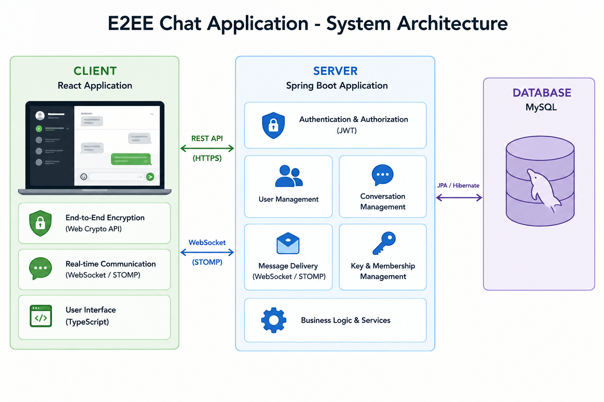
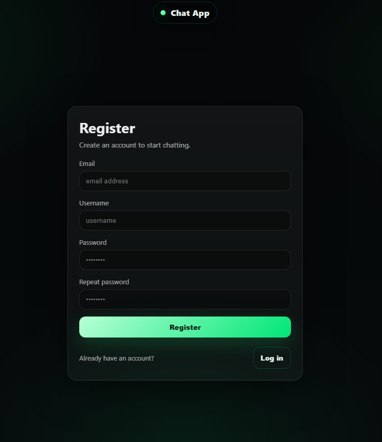
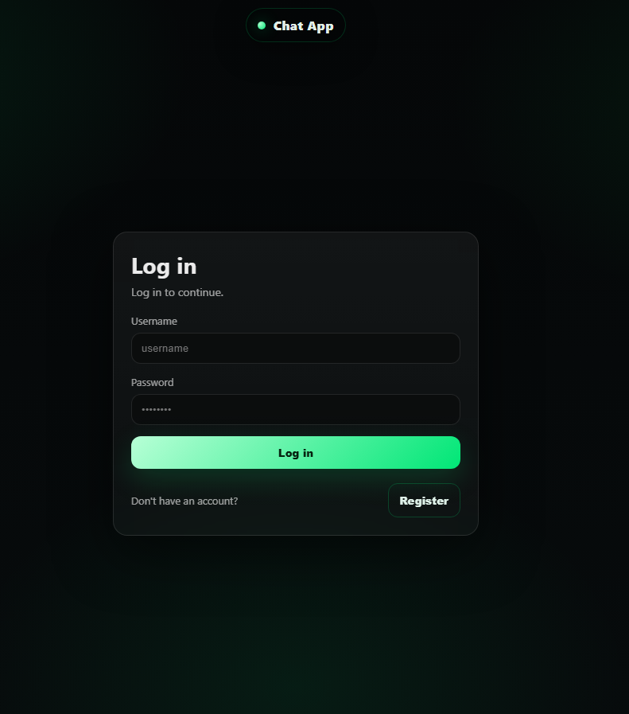
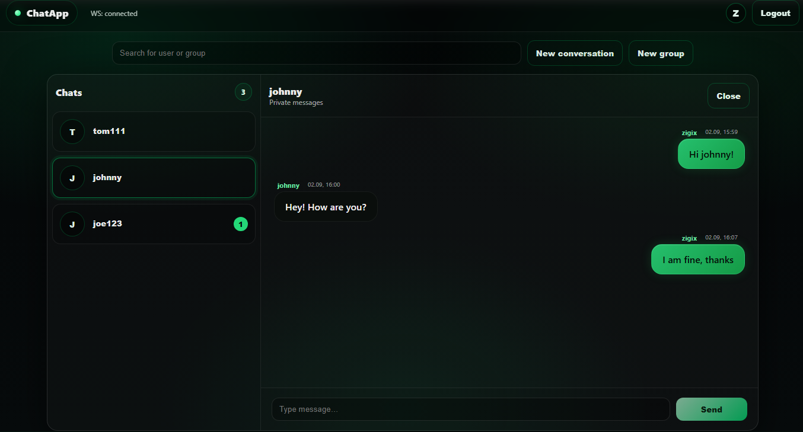
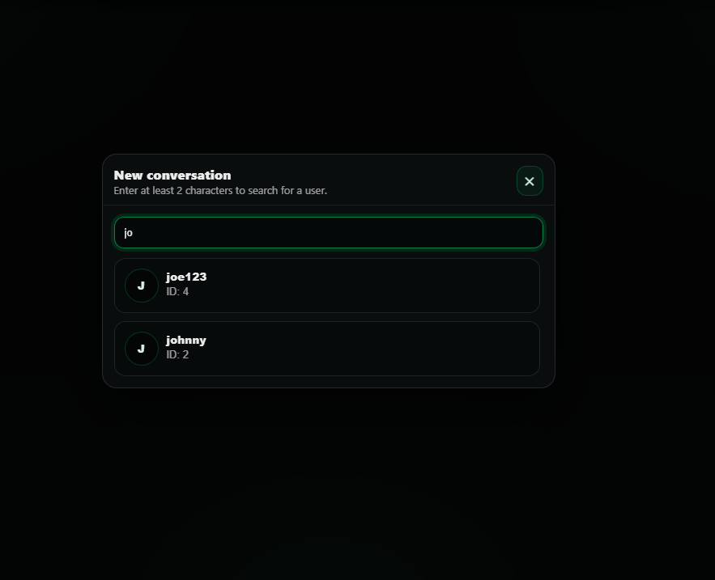
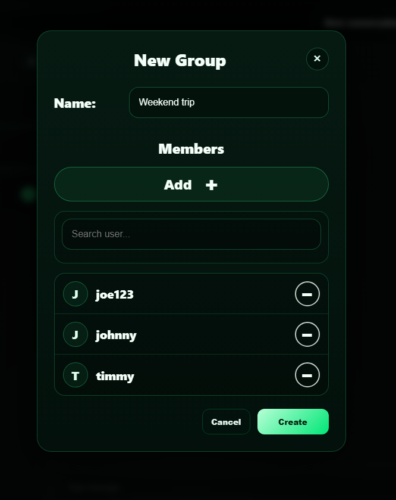
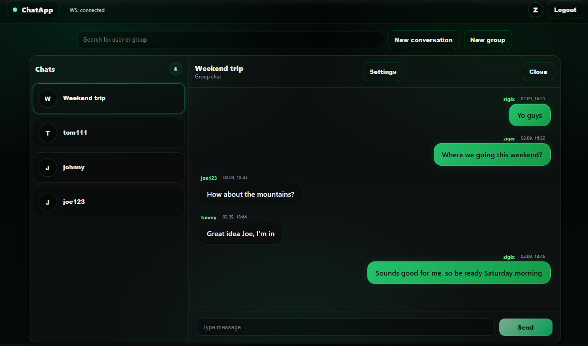
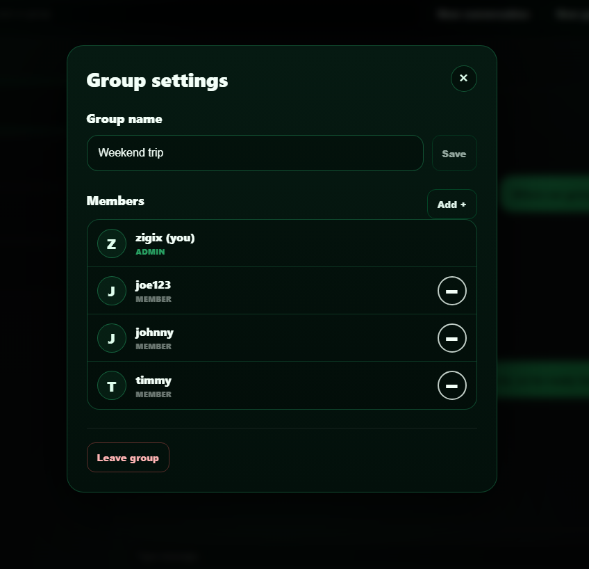

# E2EE Chat Application

A complete web-based End-to-End Encrypted (E2EE) chat application consisting of a React client, Spring Boot server, and MySQL database.

This repository serves as the main entry point for the project. It combines the client and server repositories as Git Submodules and provides the Docker Compose configuration required to build and run the complete application stack.

Server repository is here: **➡️[e2ee-chat-server](https://github.com/Zigix/e2ee-chat-server)**

Client repository is here: **➡️[e2ee-chat-client](https://github.com/Zigix/e2ee-chat-client)**

## Table of Contents
- [Project Overview](#project-overview)
- [Features](#features)
- [Architecture](#architecture)
- [Application Preview](#application-preview)
    - [Registration view](#registration-view)
    - [Login view](#login-view)
    - [Main chat view](#main-chat-view)
    - [Window for searching users to start new private conversation](#window-for-searching-users-to-start-new-private-conversation)
    - [Create new group window](#create-group-conversation-window)
    - [Group chat conversation](#group-chat-conversation-view)
    - [Group management window](#group-management-window)
- [Run the application locally](#run-the-application-locally)
    - [Clone the repository](#1-clone-the-repository)
    - [Initialize the submodules](#2-initialize-the-submodules)
    - [Start the application](#3-start-the-application)
    - [Access the application locally](#4-access-the-application)

## Project Overview

E2EE Chat is a **web-based messaging application** designed for **secure and private communication** between users. 
It allows users to communicate through conversations and exchange messages while protecting their content using **End-to-End Encryption**. 

The application provides a simple and intuitive environment for everyday communication, supporting both individual and group interactions. 
The project focuses on combining the convenience of a modern web messenger with **privacy and security principles**.

## Features

- User registration and login
- Private conversation between two users
- Group conversations with multiple participants
- Real-time messaging
- End-to-end encrypted communication

## Architecture



## Application Preview

The application provides a simple and intuitive interface. Below are selected screenshots presenting the main views and functionality of the application.

### Registration view



### Login view



### Main chat view



### Window for searching users to start new private conversation



### Create group conversation window



### Group chat conversation view



### Group management window




## Run the application locally

The complete application can be run locally using the Docker Compose and configuration provided in this repository in `docker-compose.yml`.

### 1. Clone the repository

First, clone the main repository:

```bash
git clone https://github.com/Zigix/e2ee-chat-application.git
cd e2ee-chat-application
```

### 2. Initialize the submodules

The client and server are included in this repository as Git submodules. They are not downloaded automatically when the repository is cloned, so the submodules need to be initialized and fetched manually:

```bash
git submodule update --init --recursive
```

This will download the E2EE Chat Client and E2EE Chat Server repositories into their respective directories.

### 3. Start the application

Once the submodules have been initialized, build and start the complete application using Docker Compose:

```bash
docker compose up --build
```

Docker Compose will build the required images and start all services defined in the configuration, including the client, server, and MySQL database.

### 4. Access the application

Once all services are running, the application can be accessed at:

```
http://localhost:5173
```

The backend API is available at:

```
http://localhost:8080
```

To stop the application, press **Ctrl+C** or run:

```bash
docker compose down
```
